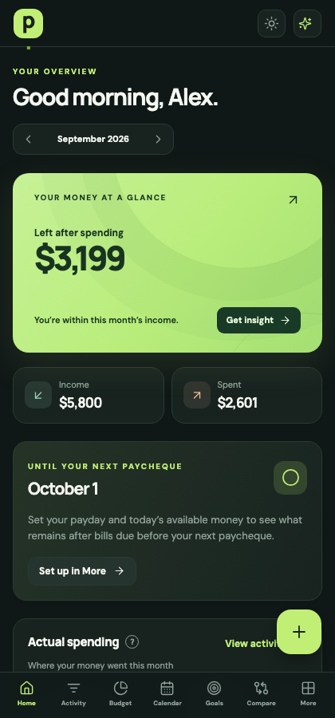
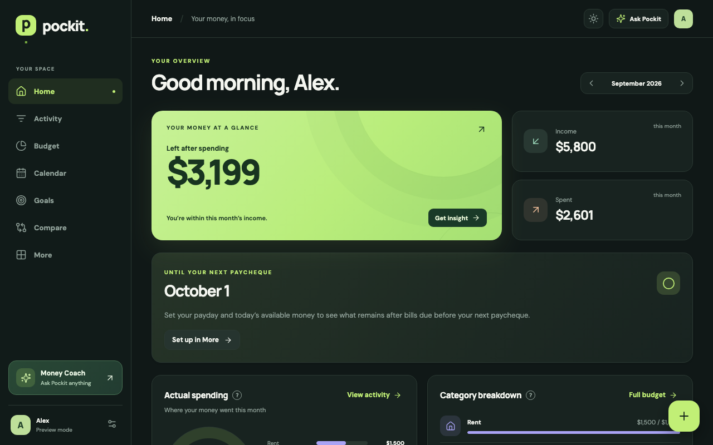

# Pockit

**A quieter way to see where your money goes and decide what comes next.** Pockit is a budget planner built for an iPhone Home Screen, with a responsive desktop view for Mac and Windows. It combines day-to-day spending, monthly plans, bills, savings, and debt in one place.

[Open Pockit](https://pockit-budget.vercel.app)

## A look inside

These screenshots use Pockit's preview mode and sample data.

## The experience

Pockit starts with a short setup about pay, housing, spending, savings, and debt. Those answers create a useful starting plan; every category and goal can be changed later. If someone leaves during setup, their progress is saved to their account.

| Area         | What it helps you do                                                                                   |
| ------------ | ------------------------------------------------------------------------------------------------------ |
| **Home**     | See income, spending, money remaining, upcoming bills, and categories that need attention.             |
| **Activity** | Add a transaction quickly, repeat a recent merchant, review a CSV import, search, and correct entries. |
| **Budget**   | Give categories monthly amounts, group them, and choose whether unused money resets or rolls forward.  |
| **Calendar** | See payments by day and record a bill payment as an Activity transaction.                              |
| **Goals**    | Follow savings and debt progress, explore a payoff order, and try changes in the What-if Lab.          |
| **Compare**  | Put months and categories side by side, inspect the transactions behind a change, and spot trends.     |
| **More**     | Adjust the theme and preferences, manage passkeys and reminders, and export or delete account data.    |

The Money Coach answers common questions using the budget's recorded numbers and rules. It does not send financial data to a language model or require a paid AI service.

## Details that matter

- **Built for a phone:** an installable web app with dark and light themes, large touch targets, reduced-motion support, and charts that can be explored by touch.
- **Clear about estimates:** paycheque, savings, and debt projections show what the current plan implies. They are not a bank balance or a promise of a payoff date.
- **Safer edits across devices:** saves show their cloud status. If two devices change the same budget, Pockit asks which full copy to keep and offers a download before the choice.
- **Connected actions:** recording a goal contribution or bill payment can create the matching Activity entry, so progress and spending tell the same story.
- **Private accounts:** email/password sign-in, optional passkeys, and per-user access rules in Supabase. A signed-in device can keep a pending copy while offline and sync it later.

## How it was built

Pockit uses **React, TypeScript, and Vite** for the app; custom CSS, SVG, and Lucide for the interface; **Supabase Auth and Postgres** for accounts and saved budgets; and **Vercel Functions** for account emails and optional bill reminders. Receipt text recognition runs on the device with Tesseract.js. The project has calculation and interaction tests in **Vitest** and browser layout tests in **Playwright**.

The repository is organized by responsibility: `src/screens` contains the main views, `src/components` holds shared UI, `src/lib` contains finance and storage logic, `server` and `api` contain server-side features, and `supabase` contains database setup. The app's design and code are original; Waypoint Budget Planner was one source of product inspiration, and Pockit is not affiliated with Waypoint Budget Inc.

## Current scope

Pockit supports manual entry and reviewed CSV imports. **It does not connect directly to a bank yet.** It also does not combine multiple people's finances into one shared budget or convert currencies. The installed app needs a connection for sign-in and cloud sync; a saved device copy can be available offline, but browser storage can be cleared. JSON export provides an additional backup.

This is an independent project under active development. For local development, deployment, and service configuration, see the [maintainer guide](docs/MAINTAINER_GUIDE.md).
